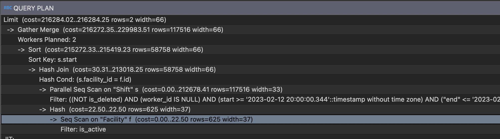
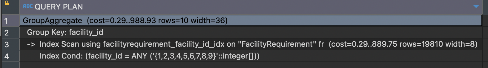
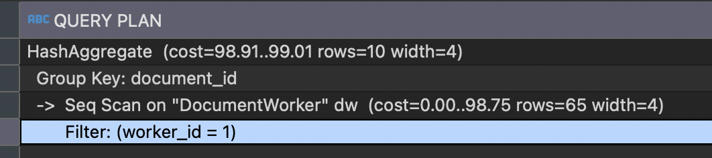

# SQL improvements

We can use `explain` postgres' resource to help us understand how we can improve our queries in database.

## Queries used for selecting shifts

Using explain in query used to join shifts with `worker_id` = null, the range of date between date (`start` and `end`), and `profession`, will be
something like bellow:

```
explain SELECT 
    s.id, s."start", s."end", s."profession", s."is_deleted", s.worker_id, s.facility_id, f."name" , f.is_active 
FROM public."Shift" s 
INNER JOIN public."Facility" f ON f.id = s.facility_id 
WHERE s.is_deleted = false and f.is_active = true 
AND s.profession = 'CNA' AND s."worker_id" IS NULL 
AND s."start" >= '2023-02-12 20:00:00.344' AND s."end" <= '2023-02-13 20:00:00.344' 
order by s."start" 
OFFSET 100 LIMIT 2;
```



------------------

Looking to these informations above, we can notice that the most expensive task inside this query, is ordering the column `start`, so we must to create a index to column `start`.

We can also create a multi index for columns `worker_id`, `profession`, `start` and `end` columns, but it's an OPTIONAL index, thinking that this index
will use much space in disk, and it won't have a great impact inside query.

And as the last step, the table `facility` needs an index over the columns `facility_id` and `is_active`.

## Queries for selecting facility requirements

For query to select facility requirements, will be something like below

```
explain 
	SELECT fr.facility_id, array_agg(distinct fr.document_id) as documents_id 
	FROM  public."FacilityRequirement" fr
	WHERE fr.facility_id = ANY('{1,2,3,4,5}'::int[])
	GROUP BY fr.facility_id;
```



---------

This query is simple, we only need to create an index over the column `facility_id`


## Query for selecting Worker Documents

This query will be something like this:

```
explain 
SELECT DISTINCT dw.document_id 
FROM public."DocumentWorker" dw 
WHERE dw.worker_id = 1;
```



---------

For this query, we just need to create an index over `worker_id`.

## Add new column in shifts

I would consider create a new column with a single index over it, named `date`, and it will save the simplified date, in format `yyyy-mm-dd`, and we could change the query to order by (also group by) using this column. 

For a big quantity of data, it probably will have a better performance than ordering over a full datetime.

## Embedding dates in sql query to find only shifts not overloaded

Now we're getting shifts in database and after comparing in code. It is possible to create conditions in query to only return shifts that not conflict with others that worker already have filled.